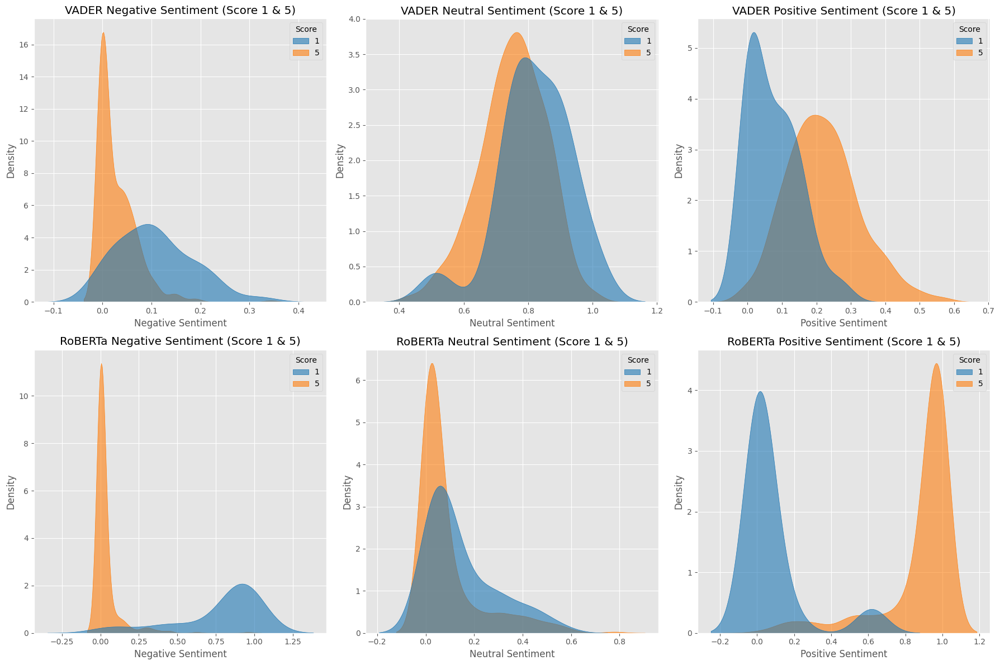

# Sentiment Analysis on Amazon Reviews

This project performs sentiment analysis on Amazon product reviews using:
- **VADER**: A lexicon-based sentiment analysis tool.
- **RoBERTa Pretrained Model**: A transformer-based model for context-aware sentiment analysis.
- **Hugging Face Pipeline**: A simple API for quick sentiment analysis.

## Overview

The dataset contains Amazon reviews, which are analyzed to predict sentiment (positive, neutral, negative) and compare predictions from VADER and RoBERTa.

### Key Steps:
1. **Data Exploration**: Visualizations of review scores, text lengths, and missing data.
2. **VADER Sentiment Analysis**: Using NLTK's `SentimentIntensityAnalyzer` for scoring.
3. **RoBERTa Model**: Using a pretrained transformer-based model for sentiment scoring.
4. **Comparison**: Visual comparisons between VADER and RoBERTa sentiment scores using pair plots, heatmaps, and distributions.

### Results:


- Sample Review: "
> Vader:
 ```python
{
  'neg': 0.22,  # Negative sentiment score
  'neu': 0.78,  # Neutral sentiment score
  'pos': 0.0,   # Positive sentiment score
  'compound': -0.5448  # Overall sentiment score (compound score)
}
```
> RoBERTa:
```python
{
  'roberta_neg': 0.97635514,  # Negative sentiment score
  'roberta_neu': 0.020687465,  # Neutral sentiment score
  'roberta_pos': 0.0029573706  # Positive sentiment score
}
```
### Visualizations:
- **Pair plots**: Compare sentiment scores from both models.
- **Violin and KDE plots**: Show the distribution of sentiment scores across review ratings.

## Installation

Clone the repo and install dependencies:
```bash
git clone https://github.com/yourusername/sentiment-analysis-amazon-reviews.git
cd sentiment-analysis-amazon-reviews
pip install -r requirements.txt


